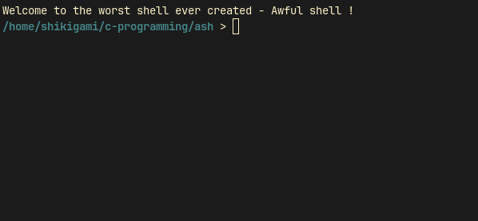
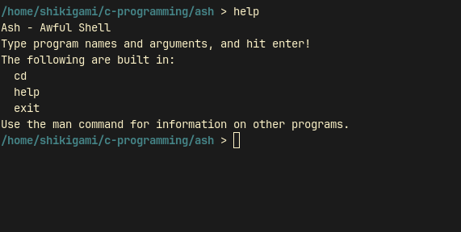
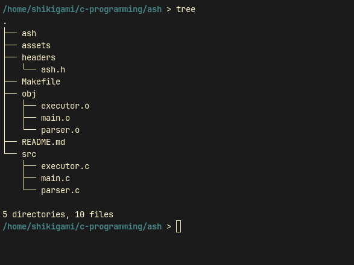
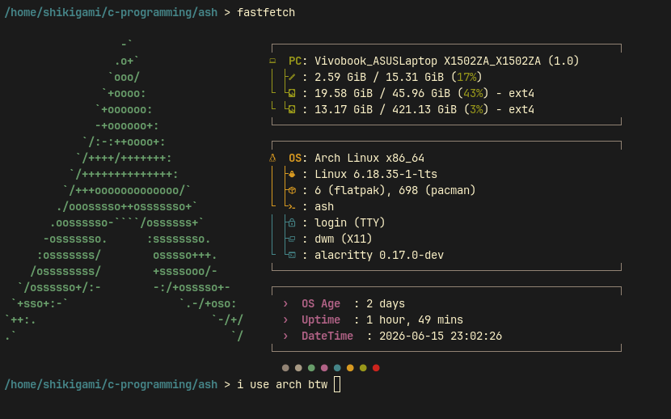

# Ash

A very minimal implementation for a Unix shell in C.

## Main Functionality

- Shell loop that reads user input, parse it, and show output as long as it's working (that's how any shell works btw XD).

---
## built-in commands
    - cd
    - help
    - exit

**NOTE**: if you type any other command that you usually use, like ls or grep, it will work, even though it's not implemented, want to know why ? read the source code bro (hint: ash_launch and ash_execute functions in executor.c).

---

---

---

---

---
## If you ever wish to contribute, don't hesitate!
